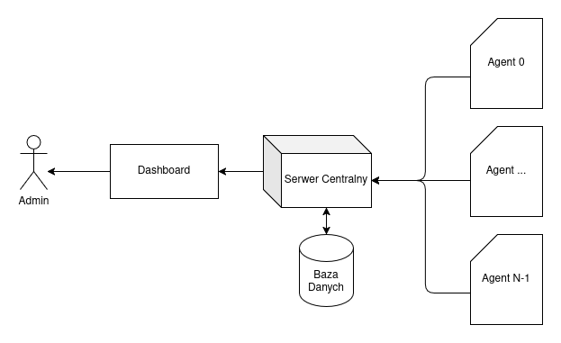

# Architektura Systemu Volta

## Wizja i Zakres

### Wizja

Stworzenie lekkiego, wydajnego i wysoce konfigurowalnego narzędzia do ciągłego monitorowania metryk systemowych, ze szczególnym naciskiem na śledzenie zużycia energii.

### Zakres

W zakresie projektu mieści się zaprojektowanie i implementacja następujących kluczowych funkcjonalności:

- Wsparcie dla monitorowania zaawansowanych metryk energetycznych (moc CPU/GPU) oraz sprzętowych (BMC).
- Wsparcie dla monitorowania standardowych metryk systemowych (użycie CPU, RAM, dysku, sieci).
- Implementacja dwóch trybów pracy:
  - [Lokalny](#model-lokalny)
  - [Zdalny](#model-zdalny)
- Wysokowydajny transport danych między agentem a serwerem, zoptymalizowany pod kątem niskiego narzutu i oszczędności energii **gRPC**.
- Wizualizacja w czasie rzeczywistym **WebSockets**.
- Wsparcie dla platform Linux.
- Konfigurowalność agenta, w tym:
  - Wybór monitorowanych metryk.
  - Definiowalna częstotliwość próbkowania metryk.
  - Wybór rdzenia, na którym uruchamiany agent. 

Platformy: Główny cel to Linux; drugi cel to Windows.

### Poza zakresem

Na tym etapie projekt nie jest:

- Systemem do zbierania i analizy logów tekstowych.
- Systemem do alertowania w postaci powiadomień.
- Narzędziem do tracingu.

Zaawansowanym systemem alertowania (jak Prometheus Alertmanager).

## Architektura Wysokopoziomowa

Architektura opiera się na klasycznym modelu Agent -> Serwer. 

Jeden **Serwer Centralny** działa jako punkt agregacji, odbierając dane od wielu Agentów (0..n). Agent przesyła zebrane dane wyłącznie do jednego skonfigurowanego serwera.

Dashboard łączy się wyłącznie z **Serwerem Centralnym**, który udostępnia mu zarówno zagregowane dane historyczne, jak i strumień "na żywo" od wybranych agentów.

## Modele Wdrożeniowe

### Model Lokalny

Przeznaczony do rozwoju, testów lub monitorowania pojedynczej maszyny.

- Wszystkie komponenty działają na tej samej maszynie (`localhost`).
- Agent wysyła dane poprzez **gRPC** na lokalny port.
- Serwer uruchamiany jest w "trybie lekkim" (TODO)

### Model Zdalny

Docelowa architektura dla środowisk serwerowych.

- Agent jest instalowany jako natywna usługa systemowa na każdej monitorowanej maszynie. 
- Platforma Centralna (Serwer, Baza Danych, Dashboard) jest uruchamiana na dedykowanym serwerze zarządzającym, jako zestaw kontenerów.

## Komponenty

### Agent

Główny komponent zbierający dane, napisany w C++ dla zapewnienia maksymalnej wydajności i minimalnego narzutu na monitorowany system. Działa jako usługa systemowa w przestrzeni użytkownika na hoście.

Jego zadaniem jest cykliczne odpytywanie niskopoziomowych API sprzętowych (jak NVML, oneAPI, RAPL) oraz systemowych (jak `/proc`) o metryki zdefiniowane w [METRICS.md](%20METRICS.md). Zebrane dane są następnie wysyłane do serwera centralnego przez trwałe energooszczędne strumieniowanie **gRPC**.

### Serwer

Centralny punkt do zbierania i agregacji danych całej platformy. Jest odpowiedzialny za odbieranie strumieni danych od wszystkich podłączonych agentów.

W trybie zdalnym zapisuje dane w bazie danych i dodatkowo sam aktywnie monitoruje hosty (odpytując ich **BMC** o całkowity pobór mocy). Wystawia też dwa rodzaje API dla dashboardu: **WebSockets** (do rozgłaszania danych na żywo) oraz **REST / gRPIC-Web** (do odpytywania o dane historyczne).

### Baza Danych

### Dashboard
