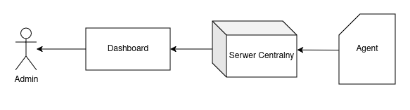

# Architektura Systemu Volta

## Wizja i Zakres

### Wizja

Stworzenie lekkiego, wydajnego i wysoce konfigurowalnego narzędzia do ciągłego monitorowania metryk systemowych, ze szczególnym naciskiem na śledzenie zużycia energii.

### Zakres

W zakresie projektu mieści się zaprojektowanie i implementacja następujących kluczowych funkcjonalności:

- Wsparcie dla monitorowania zaawansowanych metryk energetycznych (moc CPU/GPU) oraz sprzętowych (BMC).
- Wsparcie dla monitorowania standardowych metryk systemowych (użycie CPU, RAM, dysku, sieci).
- Implementacja dwóch trybów pracy:
  - [Lokalny](#model-lokalny)
  - [Zdalny](#model-zdalny)
- Wysokowydajny transport danych między agentem a serwerem, zoptymalizowany pod kątem niskiego narzutu i oszczędności energii **gRPC**.
- Wizualizacja w czasie rzeczywistym **WebSockets**.
- Pierwotnie narzędzie dedykowane na system `GNU Linux`
- Konfigurowalność agenta, w tym:
  - Wybór monitorowanych metryk.
  - Definiowalna częstotliwość próbkowania metryk.
  - Wybór rdzenia, na którym uruchamiany agent. 

### Poza zakresem

Na tym etapie projekt nie jest:

- Wieloplatformowy, **brak wsparcia dla systemów Windows**.
- Systemem do zbierania i analizy logów tekstowych.
- Systemem do alertowania w postaci powiadomień.
- Narzędziem do tracingu.
- Archiwizacja danych.
- Zaawansowanym systemem alertowania (jak Prometheus Alertmanager).

## Architektura Wysokopoziomowa

Architektura opiera się na klasycznym modelu Agent -> Serwer. 

Jeden **Serwer Centralny** działa jako punkt agregacji, odbierając dane od wielu Agentów (1..n). Agent przesyła zebrane dane wyłącznie do jednego skonfigurowanego serwera. Każdy z **Agentów** reprezentuje osobną maszynę, na której jest uruchomiony. 

Dashboard łączy się wyłącznie z **Serwerem Centralnym**, który udostępnia mu zarówno zagregowane dane historyczne, jak i strumień "na żywo" od wybranych agentów.

## Modele Wdrożeniowe

### Model Lokalny

Przeznaczony do rozwoju, testów lub monitorowania pojedynczej maszyny. Dokonywane pomiary są wyłącznie tymczasowo przechowywane w pamięci przez określony z góry czas życia pomiaru (np. ostatnia godzina).

- Wszystkie komponenty działają na tej samej maszynie (`localhost`).
- Serwer uruchamiany jest w "trybie lekkim" **bez połączenia z bazą danych**, przechowuje pomiary w **buforze cyklicznym (Ring Buffer)** o określonym rozmiarze w pamięci RAM. 

### Model Zdalny

Docelowa architektura dla środowisk serwerowych. W przeciwieństwie do modelu lokalnego, tutaj dane są **trwale składowane w bazie danych**, co umożliwia analizę trendów i historii w długim okresie (zgodnie z przyjętą polityką retencji).

- Agent jest instalowany jako natywna usługa systemowa na każdej monitorowanej maszynie i wysyła dane do serwera centralnego poprzez **gRPC**.
- Platforma Centralna jest uruchamiana na dedykowanym serwerze zarządzającym jako zestaw kontenerów (Docker), zapewniając separację środowiska uruchomieniowego od monitorowanego sprzętu.

## Komponenty

### Agent

Główny komponent zbierający dane, napisany w C++ dla zapewnienia maksymalnej wydajności i minimalnego narzutu na monitorowany system. Działa jako usługa systemowa w przestrzeni użytkownika na hoście.

Jego zadaniem jest cykliczne odpytywanie niskopoziomowych API sprzętowych (jak NVML, oneAPI, RAPL) oraz systemowych (jak `/proc`) o metryki zdefiniowane w [METRICS.md](METRICS.md). Zebrane dane są następnie wysyłane do serwera centralnego przez trwałe energooszczędne strumieniowanie **gRPC**.

### Serwer

Centralny punkt do zbierania i agregacji danych całej platformy. Jest odpowiedzialny za odbieranie strumieni danych od wszystkich podłączonych agentów.

W trybie zdalnym zapisuje dane w bazie danych i dodatkowo sam aktywnie monitoruje hosty (odpytując ich **BMC** o całkowity pobór mocy). Wystawia też dwa rodzaje API dla dashboardu: **WebSockets** (do rozgłaszania danych na żywo) oraz **REST / gRPC-Web** (do odpytywania o dane historyczne).

### Baza Danych

Komponent odpowiedzialny za trwałe przechowywanie metryk, wykorzystywany wyłącznie w trybie zdalnym.

#### Zakres 
Rolą bazy danych jest wyłącznie przechowywanie i udostępnianie **metryk szeregów czasowych (time-series)**. Musi być zoptymalizowana pod kątem bardzo szybkiego zapisu (wysoki ingest rate od wielu agentów) oraz szybkich zapytań analitycznych (agregacje, filtrowanie po czasie) dla dashboardu. Rekomendowaną technologią jest dedykowana baza szeregów czasowych, typu  **TimescaleDB** lub **InfluxDB**.

#### Żywotność

W celu zarządzania przestrzenią dyskową, system będzie wspierał politykę retencji. Na potrzeby projektu, **dane starsze niż 30 dni będą automatycznie i trwale usuwane**.

#### Archiwizacja

Zaawansowana archiwizacja (np. przenoszenie danych starszych niż 30 dni do wolniejszego, tańszego magazynu) jest **poza zakresem** dla tej iteracji projektu. System skupia się na retencji, a nie na archiwizacji.

### Dashboard

Punkt dostępu użytkownika do wizualizacji danych. Uruchamiany na serwerze centralnym w ramach konteneru, wystawia dane historyczne oraz strumień "na żywo".

Wersja pierwotna systemu ma wystawiać Dashboard zależnie od konfiguracji publicznie lub wyłącznie wewnątrz sieci pod zdefniowanym portem i ścieżką.